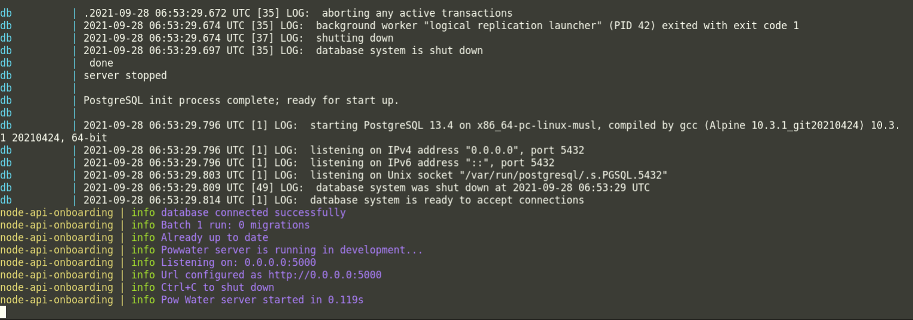

## GRACE ONBOARDING TASK

Create a RESTful API endpoint that accepts a request and creates a generic promocode.  
Create a RESTful API endpoint that accepts a request and retrieves the created generic promocode.

## Required Fields For Generic Create Request

- Campaign Name (string)
- Campaign Description (string)
- Start Date (string)
- End Date (string)
- Prefix (string)
- Number Of Codes (string)
- Offer (Object) - `{Discount:0,Delivery:0}`

## Requirements

- Ensure you have docker and docker-compose installed

### How To Run The Project

- Everything runs inside containers. To achieve this run the command below

```
docker-compose --env-file .env.dev up --build --remove-orphans
```

- If successful, you should have a terminal output similar to the one below


